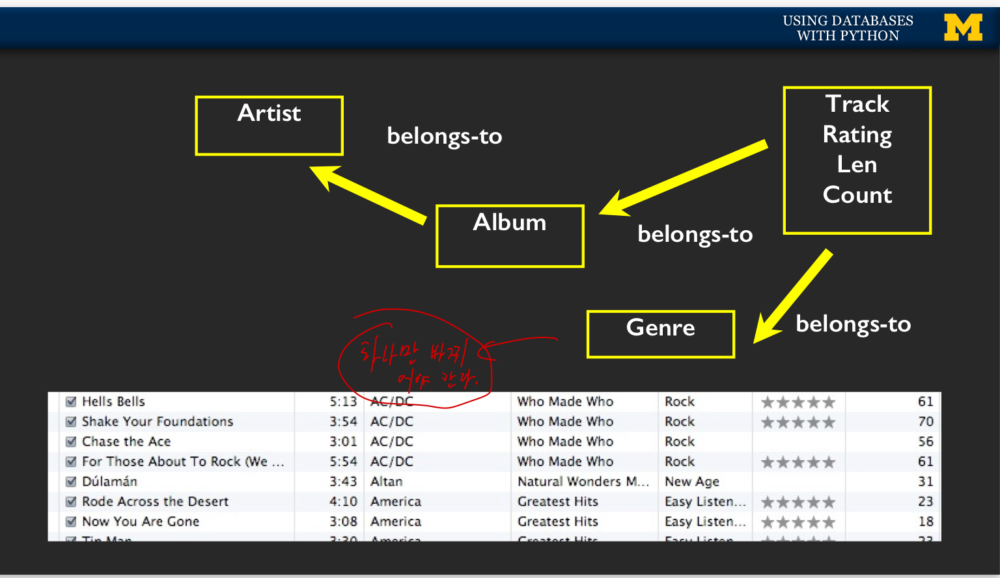
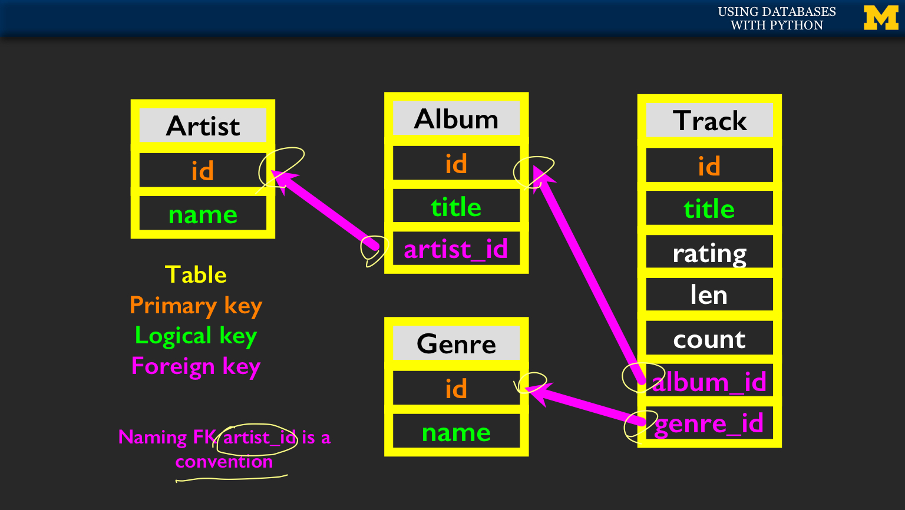
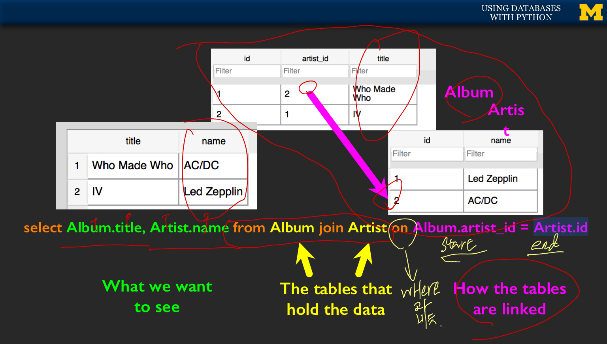

# 3주차
* Building a  Data Model :
	* 데이터 객체를 그림으로 나타내 본 다음, 어떻게 객체를 나타내고, 관계(relation)을 설정할지 figure out한다.
	* **Basic Rule: 같은 string데이터는 두번 이상 중복으로 넣지 않는다.** -> 대신 **Relation**을 사용한다.
	* ex) 아이튠즈 음악 트랙 DB 데이터 관계.

* Key Terminology
	* Primary Key ( 주황색 ) : 테이블 내부의 한 row를 지칭하는 id. 보통 **AUTOINCREMENT**로 정의한다.
		1. logical key를 절대 primary key로 사용해서는 안된다.

	* Logical Key ( 형광색 ) : 외부 테이블에서 접근 했을때, 실절적으로 보거나 획득 하려는 값, 혹은 정보.
		1. 변경 가능, albeit는 느리게 된다.

	* Foreign Key ( 분홍색 ) : 다른 테이블의 한 row를 지칭하는 id값( 목적지 테이블의 pk값) )
		1. **integer**로 매칭 비교하는게 유리.

* JOIN : SELECT 명령어의 한 부분으로써, **여러 테이블 사이를 링크한다.**
	* 반드시 **ON**(WHERE과 비슷한 역할) 을 사용하여 테이블들을 연결시키는 키를 어떻게 사용해야 할지 알려야 한다.
	* 그렇지 않을 경우, 모든 left key와 right키의 조합이 섞인 경우의 수로 row들이 출력된다.

