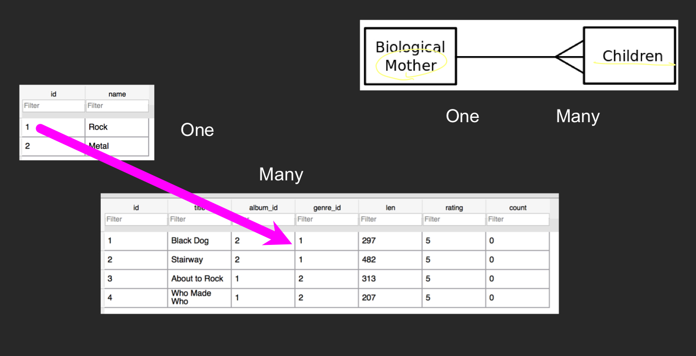
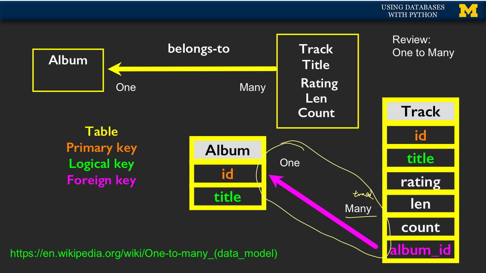
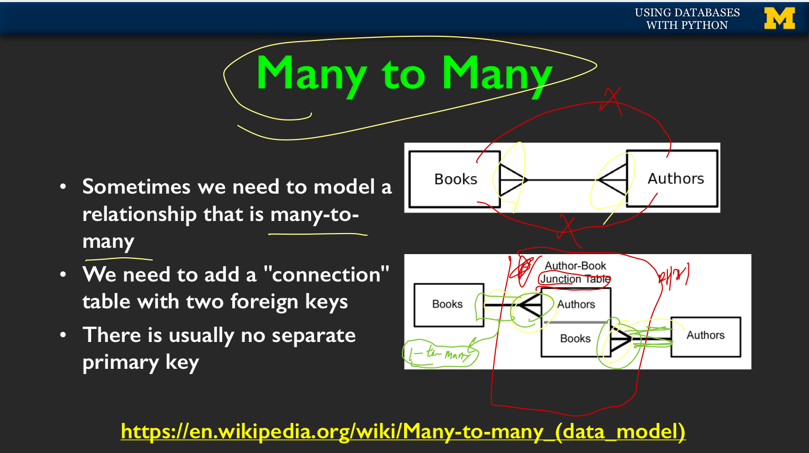
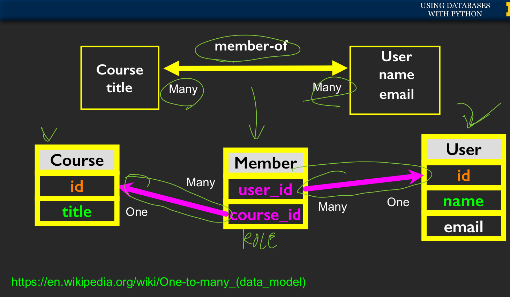
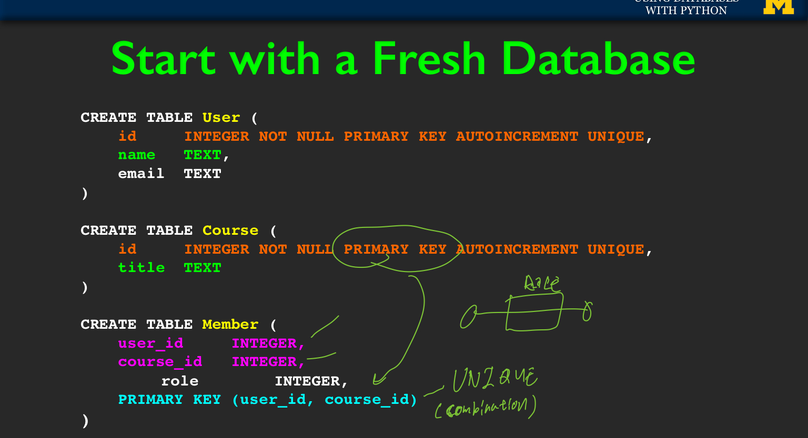
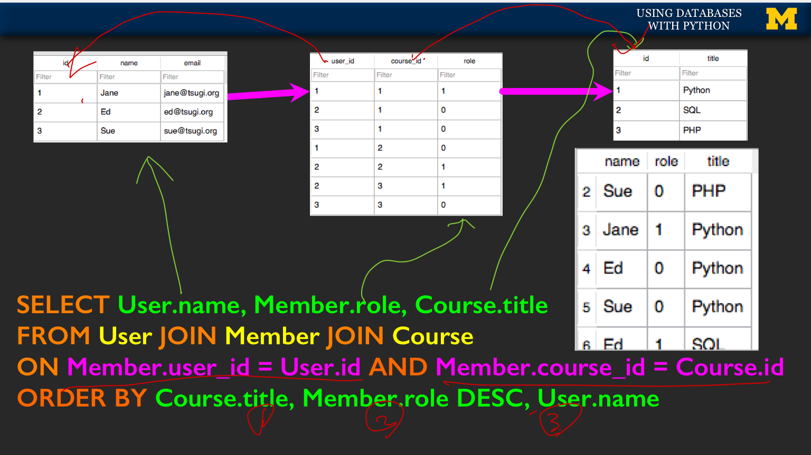

# 4주차
* Many To Many Relationship : 양방향 의존성
	* 이전에 배웠던 예시는 One-To-Many Relationship이다. ( 부모-자식 관계, 단방향 의존성 )
		* 
		* 

	*  하지만, 지금 배우는 Many-To-Many 관계는 테이블간 상호 의존성이 있으며, **Junction Table**을 활용하여 두 테이블 사이를 중계(매개)시킨다.
		* 
		* 
		*  Junction 테이블을사용 하는 이유: Many2Many를 간접적으로 (On 2 Many,  One 2 Many 를 활용하여) 구현 하기 위함이다.

* Many To Many 테이블의 구성 : Junction 테이블의 Primary Key는 **Foreign Key들의 조합의 원소이다**
		* 

* Mant To Many Rel의 탐색.
		* 

* 데이터 베이스를 이렇게 복잡하게 하는 이유: 속도 향상을 위해.

* 더 알아보면 좋을 것들
	* Index : 스트링 필드 등등의 things들의 접근 성능을 향상 시켜준다.
	* Constraints : null이 되어서는 안되는 데이터.
	* Transactions : SQL 명령을 그룹화 시키고, 한 트랜잭션이 완전히 쓰여지기 전까지 읽기가 불가능 함.