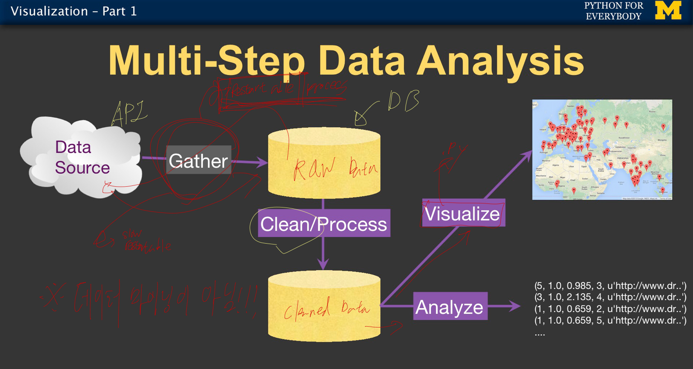
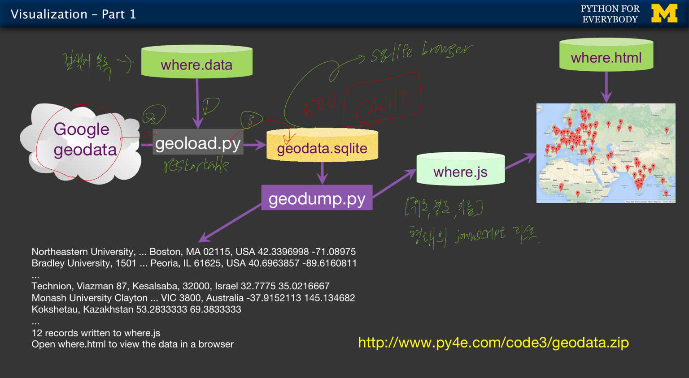

# 5주차
* 이번 주차는 시각화(Visualization)인데, 실습에 대부분의 강의구성이 이루어 져서, 정리할 내용이 그렇게 많지는 않습니다.

* 데이터 분석의 스텝
	1. 데이터 수집 : 서버, 혹은 어떠한 외부 공간으로부터 데이터를 모아온다. 이때 반드시 재시작 가능하게 구현해야 한다.
	2. 데이터 가공 : 저장한 raw데이터를 가공하여 cleaned된 데이터를 생성한다.
	3. 시각화 & 분석
	4. 

* 구현 ( 구글 api를 활용하여 웹상에 지도에 location 띄우기 )
	1. 데이터 수집: geoload.py를 활용하여 geodata를 받아온 후, geodata.sqlite에 저장.
	2. 데이터 가공: geodump.py를 활용하여 where.js에 javascript array 형태로 저장.
	3. 시각화 & 분석: where.html 파일로 보여주기.
	4. 
	