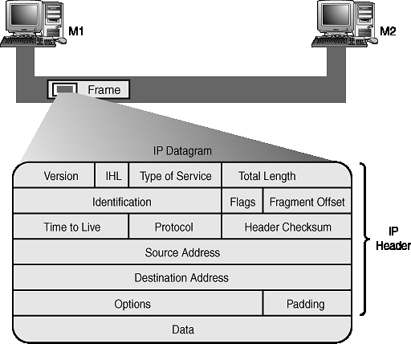
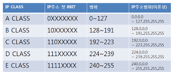

# 2주차

### The Network Layer

* IP ( Internet Protocol Address )
  * 172.16.24.1
  * IP 주소는 네트워크 장비가 아니라, **네트워크** 에 속한다. 
    * DHCP ( Dynamic Host Configuration Protocol ) : IP 자동할당 방식.
    * 동적주소 : 클라이언트
    * 정적주소 : 서버 
    * **항상 그런것은 아니다.**

* IP Datagrams and Encapsulation
  * ip datagram : 고도로 추상화된 엄격하게 정의된 필드들의 series ( **네트워크 레이어의 패킷**)
    
    * 
    * Version : 일반적인 ip는 v4를 사용한다.
    * Header Length : IPv4기준으로 보통 20 byte를 사용한다.
    * Service Type : 해당 8비트의 타입은 QoS(Quality of Service)테크닉을 구체화 하는데에 사용된다
    * Total Length : ip데이터그램의 전체 길이를 알려준다.
    * Indication Field : 메세지들을 그룹화 하는 데에 사용되는 16비트의 수.
      * cf. ) 패킷 분할시에 이부분을 참조해서 활용한다.
    * Flag Field : 데이터그램의 분할이 허용되는지, 혹은 데이터그램이 이미 분할되었는지 나타내는데에 사용된다.
    * Fragmentaion : 하나의 ip datagram을 취한다음, 여러 데이터그램들로 나누는것.
    * TTL ( Time To Live ) : 소멸되기 전 라우터를 몇개나 순회할 수 있는지를 나타낸다. 
    *  Protocol : 상위계층 ( Tranport Layer )에서 어떤 프로토콜이 해당 데이터그램을 사용하는지를 나타낸다. (8비트)
    * Header Checksum : 네트워크를 통해 패킷이 전송될때 발생한 에러를 검출하기 위해 사용 ( 1의 보수 연산으로 수행 )
    * Source, Destination IP Address : IP의 주소는 32비트 이다.
    * Options Field : 옵셔널한 필드. 주로 테스트 목적으로 데이터그램의 특수한 성질을 설정한다.
    * Padding Field : 전체 사이즈를 맞추기 위해 0으로 채워진 부분.
    
  * IP Address Classes
  
    - Address Class System : 전역 ip 주소를 어떻게 나눌지 정의하는 방법.
  
    
  
  * ARP ( Address Resolutuion Protocol ) : 특정 ip주소를 활용하여 노드의 하드웨어 주소를 찾는 데에 사용하는 프로토콜.
  
    * ARP Table : MAC주소와 IP주소가 나열되어 있는 리스트.
  
      
  
      - Arp 테이블의 entry들은 일반적으로 짧은 시간내에 만료된다.

### Subnetting

* Subnetting : 큰 네트워크를 여러 독립적 / 소규모의 서브넷으로 분할하는 프로세스.

  cf ) 잘못된 서브네팅 셋업은 종종 문제가 된다.

  

* Subnet mask : 주어진 ip주소를 네트워크 환경에 맞게 나누어 주기 위해서 씌워주는 이진수의 조합.

  

* CIDR ( Classless Inter-domain Routing ) : **Subnet개념의 확장.**
  * Demarcate : 무엇인가를 사용하지 않게 세팅한다.
  * Demarcation Point : 시스템의 어느부분이 종료되었고, 다른 하나가 시작되는지 나타내는 포인트.
  * CIDR 표기 : {ip주소} / {마스크의 비트 개수}

### Routing

* Router : 트래픽에서 목적지 주소에 따라 해당 트래픽을 forward 하는 장비.

* Basic Routing Concepts
  

  * 라우팅은, 여러 라우터를 간접적으로 거쳐서 최종 목적지에 도달하기도 한다.

* Routing Table

  

  1. Destination : 전송하려 하는 라우터의 주소.
  2. Next Hop : 다음 라우터의 주소.
  3. Total Hop
  4. Flag : 경로의 유형
     1. U : 유효
     2. H : 호스트
     3. G : 게이트웨이
  5. R.C ( Ref Count ) : 경로를 참조한 횟수
  6. U ( Use ) : 경로를 탐색한 횟수.
  7. I ( Interface ) : 패킷이 오가는데에 사용할 네트워크 인터페이스.

* Routing Protocols : 라우터간에 라우팅 정보의 교환 및 라우팅 테이블의 유지 관리를 동적으로 수행하는 프로토콜

  

  * interior gateway protocols : 
    * Distance Vector : 라우팅 테이블에 거리와 방향만을 기록한다. ( 인접 라우터 )
    * Link-State Vector : 단일 autonomous system으로 라우터들이 정보를 주고받도록 하는 벡터.
  * exterior gateway protocols :
    * EGP
    * BGP
    * IDRP
    * cf ) IANA  : autonomous system(망, 자율시스템) number을 관리하는 기구.

* Non - Routable Address Space : 네트워크의 내부망에서 모두가 사용할수 있는 ip주소범위

  * NAT (Network Address Translator ) : 사설 IP주소를 공인 IP주소로 바꿔주는데 사용하는 통신망의 주소 변환기이다.

    * **내부 망에서는 사설 IP 주소를 사용하여 통신을 하고, 외부망과의 통신시에는 NAT를 거쳐 공인 IP 주소로 자동 변환**
    * 장점 : 
      1. IP v4 주소 부족문제 해결
      2. 보안성 강화

    