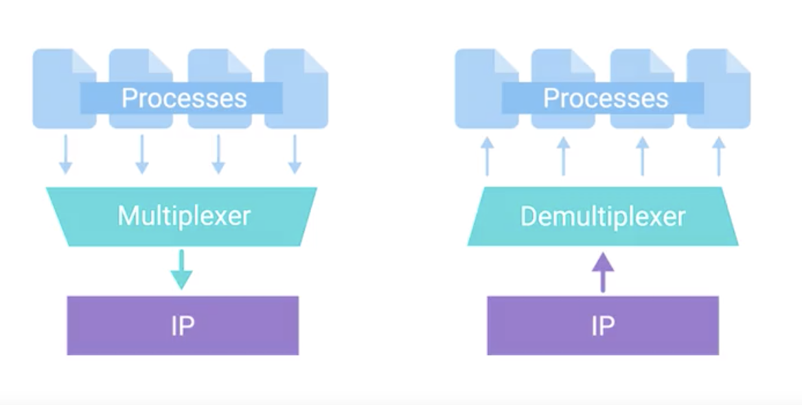
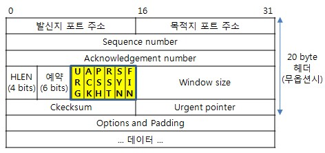
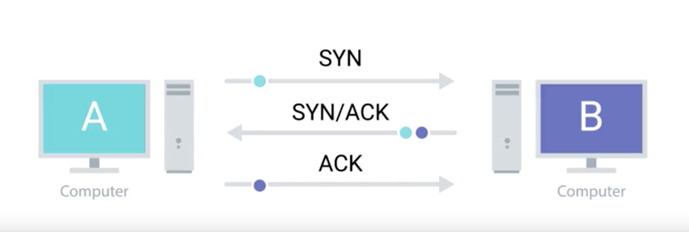
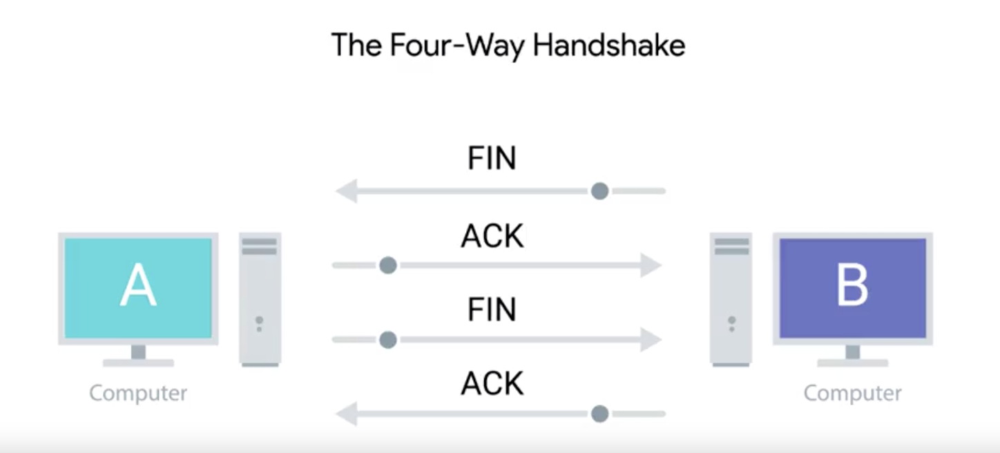

# 3주차

## Transport Layer

- Transport Layer : 트래픽이 특정 네트워크 어플리케이션을 향하도록 한다,

  - Port : 네트워크에서 특정 서비스를 돌리고 있는 컴퓨터로 트래픽을 향하게 하는 16비트의 수 ( Soket Address )

  - Multiplexing, Demultiplexing을 포트를 사용해서 한다.

    

    - 멀티플렉싱 : 출발지 호스트에서 소켓으로부터 데이터를 전달받아 데이터를 모으고, 이를 세그먼트 단위로 묶어 생성하기 위해 세그먼트 앞에 헤더를 붙여 캡슐화 하고, 이것을 네트워크 계층으로 내려 보내는 작업.
    - 디멀티 플렉싱 : 세그먼트의 데이터를 올바른 소켓으로 전달하는 작업
    - TCP 세그먼트 : tcp헤더와 데이터 섹션으로 구분된다.
      - SRC Port : special섹션의 포트에서 높은 수의 포트들이 선택된다.  (임시로 선택된 포트)
      - Sequencce Number : tcp세그먼트의 순서를 트래킹하는 32비트의 숫자.
      - ACK Number : 다음 세그먼트들의 개수
      - Data Offset : 현재 세그먼트에서 TCP헤더의 길이가 얼마인지 나타내는 4비트의 수
      - Ctrl Flags : 아래에 별도로 표기
      - TCP Window : ack가 요구되기 전에 seq numbers의 범위를 지정한다.
      - Cheksum : 
      - Urgent Pointer : 다른 세그먼트들보다 긴급할때, ctrl 플래그중 하나와 ㄱ함께 작동한다.
      - Options
      - 
        - 컨트롤 플래그
          - URG ( urgent )  : 세그먼트가 긴급하다고 여겨질 때 사용. urg pointer가 더 많은 정보를 가지고 있음.
          - ACK ( acknowledge ) : 이부분이 1이면  ack number필드가 examined 인것을 의미한다.
          - PSH ( Push ) : 전송디바이스가 수신 디바이스가 가능한한 빠르게 currently-buffered 한 데이터를 수신하는 application에  push하길 요청한다.
          - RST ( Reset ) : TCP연결의 한 사이드가 서비스로부터 복구불능이 되거나, 세그먼트가 손상되었을때 작동.
          - SYN ( Syncronize ) : 처음으로 TCP 연결을 진행할때 수신부의 첫부분이 seq number 필드가 examine 했는지 확인한다.
          - FIN ( Finish ) : 이부분이 1이면, 전송컴퓨터는 더이상 추가적인 데이터를 전송하지 않고, 연결 종료가 시작된다.
      - Hand Shake : 2개의 디바이스가 서로 같은 프로토콜이고, 서로 이해 가능한지 확인하는 방법.
        - 3-way handshake : 연결을 시작할때
          - 
        - 4-way handshake : 연결을 종료할때
          - 
      - TCP 소켓 상태
        - socket : 어딘가에서 정의되어있는 실제 무언가를 구현해 놓은것
        - LISTEN : TCP 소켓이 들어오는 연결을 들을 준비가 되어있음을 알림.
        - SYNC_SENT : sync 요청이 보내졌으나, 연결은 시작되지 않은 상태
        - ESTABLISHED : 양쪽이 모두 데이터를 자유롭게 전송이 가능한 상태,
        - FIN_WAIT : FIN 플래그가 전송되었으나, 상태쪽의 ACK를 기다리고 있는 상태.
        - CLOSE_WAIT : TCP레이어에서는 연결이 닫혔으나, 소켓에 있는 application은 아직 살아있는 상태.
        - CLOSED : 연결이 완벽하게 닫힌 상태.
      - Connection-Oriented-Protocol : 모든 데이터가 적절하게 전송이 되었는지 확인하면서 전송을 시작하는 방식. 
        - TCP가 대표적
      - Connectionless Protocol : (UDP) -> 비디오 전송이 대표적.
      - Firewall : 특정 기준을 충족하면, 트래픽을 차단하는 디바이스.

## 	Application Layer 

* Web Browser, WebServer(IIS, 아파치, ngix) : HTTP로 통신한다.
* OSI ( Open System Interface ) 7계층 
  * Physical - Data Link - Network - Transport - **Session** - **Presentation** - Application
    * Session : 실제 **application** 과 **Transport** 사이에서 커뮤티케이션을 기능화 시킴.
    * Presentation : 캡슐화 되지않은 **Application Layer** 데이터가 application의 Question에 의하여 이해가 되는지 확인하는 역할을 담당한다.